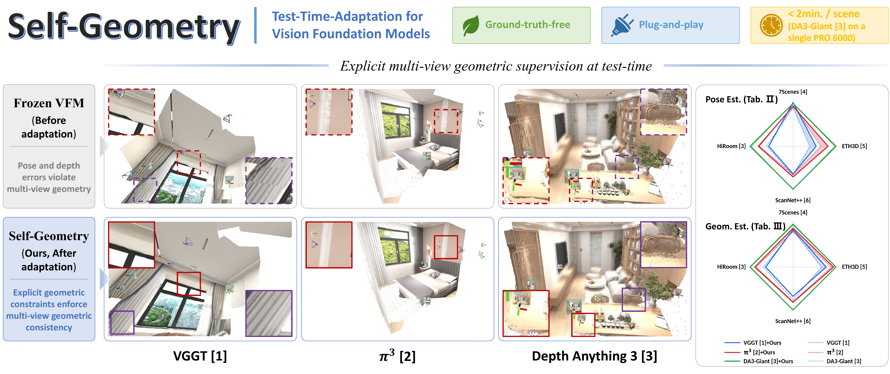
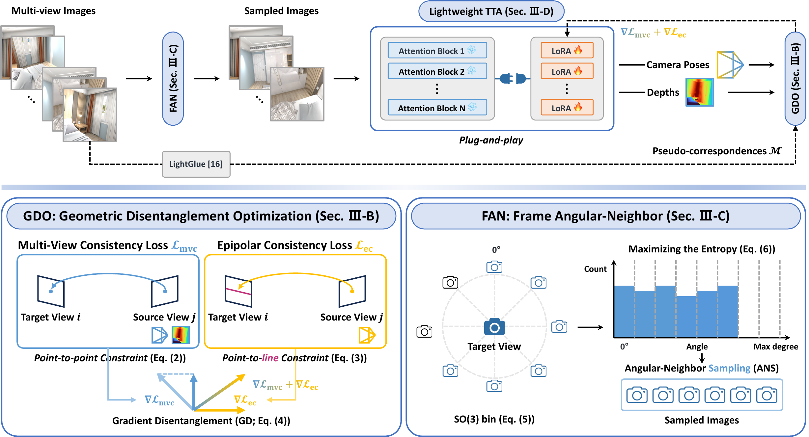

<h1>
  
  Self-Geometry: GT-Free and Plug-and-Play Test-Time Adaptation for Geometrically Consistent 3D Vision Foundation Models
</h1>

**<a href="https://github.com/sh25youn2">Seokhyun Youn</a>**<sup>1</sup>,
**<a href="https://github.com/rpdahxn">Dahyeon Kye</a>**<sup>1</sup>,
**<a href="https://scholar.google.com/citations?user=EULut5oAAAAJ&hl=ko">Sung-Ho Bae</a>**<sup>2†</sup>,
**<a href="https://github.com/JihyongOh">Jihyong Oh</a>**<sup>1†</sup>
<br>

<sup>1</sup>Creative Vision and Multimedia Lab (CMLab), Chung-Ang University
<sup>2</sup>Efficient Neural Computing Lab (ENC Lab), Kyung Hee University
<br>
†Corresponding authors

[](https://cmlab-korea.github.io/Self-Geometry/)
[](https://arxiv.org/abs/xxxx.xxxxx)


This repository is the official PyTorch implementation of
**"Self-Geometry: GT-Free and Plug-and-Play Test-Time Adaptation for Geometrically Consistent 3D Vision Foundation Models."**



---

## News

- **2026.08.07**: Self-Geometry [Project page](https://cmlab-korea.github.io/Self-Geometry/) is initially released.
- **arXiv release, code release, and acceptance updates coming soon.**

---

<details>
<summary><b>Abstract</b></summary>
<br>

Recent **Vision Foundation Models (VFMs)** predict depth, camera pose, and pointmap in a single forward pass without per-scene optimization, achieving strong generalization. However, enforcing explicit multi-view geometric consistency, e.g., through bundle adjustment, is computationally costly and is thus not imposed during VFM pretraining, so such inconsistency can arise. To address this, implicit self-consistency derived from model outputs (e.g., pointmaps, features), though enforced at test-time in prior work, delivers inherently limited performance gain, especially on scenes where the pretrained VFM is highly inaccurate.

In contrast to this implicit signal, we propose **Self-Geometry**, a **plug-and-play test-time adaptation (TTA) pipeline** that directly imposes explicit multi-view geometric constraints using **2D pixel correspondences** as **pseudo ground-truth**. Our proposed Self-Geometry consists of

- **Geometric Disentanglement Optimization (GDO)**, which combines *Multi-View Consistency (MVC)* and *Epipolar Consistency (EC)* losses with *Gradient Disentanglement (GD)* to prevent gradient conflict;
- **Frame Angular-Neighbor (FAN)**, a view sampler based on *scene-scale-invariant* SO(3) geodesic distances for lightly imposing these constraints;
- **Lightweight TTA**, which adapts VFMs via **LoRA**.

Our method achieves consistent improvements in both Pose Estimation and Geometry Estimation across **six VFMs** (VGGT, π³, DA3-Giant/Large/Base/Small) and **four benchmarks** (7Scenes, ETH3D, ScanNet++, HiRoom), completing scene-wise adaptation within **two minutes per-scene** on a single NVIDIA RTX PRO 6000.

</details>

<details>
<summary><b>Method Overview</b></summary>
<br>



Self-Geometry adapts a frozen pretrained VFM to a target scene through three complementary components:

| Component | Name | Description |
|-----------|------|-------------|
| **GDO** | Geometric Disentanglement Optimization | Combines the *point-to-point* MVC Loss (Eq. 2) and the *depth-independent point-to-line* EC Loss (Eq. 3) with Gradient Disentanglement (Eq. 4) to prevent the gradient conflict that can arise between the two losses on the camera poses. |
| **FAN** | Frame Angular-Neighbor | An SO(3)-guided view sampler that selects the target view maximizing SO(3)-bin entropy (*Geometry-Rich View Selection*) using *scene-scale-invariant* SO(3) geodesic distances (Eq. 5), achieving uniform scene coverage. |
| **Lightweight TTA** | LoRA-based Per-Scene Adaptation | Inserts LoRA only into the QKV weights of the pretrained VFM's attention blocks. The pretrained parameters remain frozen and only LoRA is updated, completing per-scene adaptation within two minutes on a single NVIDIA RTX PRO 6000. |

Together, these components operate as a **GT-free**, **Teacher-free**, **Plug-and-play**, and **Explicit-Geometry** TTA pipeline.

</details>

---

## Code Release

**Code will be released soon.** In the meantime, please visit our
[project page](https://cmlab-korea.github.io/Self-Geometry/) for interactive pointmap /
depth-map comparisons, quantitative and qualitative results.

---

## Results

Please visit our [project page](https://cmlab-korea.github.io/Self-Geometry/) for:

- **Interactive Examples**: baseline vs. Self-Geometry pointmap and depth-map slider comparisons across 5 VFM backbones (VGGT, π³, DA3-Giant/Large/Base) and 2 benchmarks (HiRoom, ScanNet++).
- **Quantitative Results**: pose (AUC@3, AUC@30) and geometry (F1-score) tables across all six VFMs × four benchmarks.
- **Qualitative Results**: side-by-side depth-error and pointmap-error visualizations against TCO and Free-Geometry.

---

## Acknowledgement

We sincerely thank the authors of [VGGT](https://github.com/facebookresearch/vggt),
[π³](https://github.com/yyfz/Pi3), and [Depth Anything 3](https://github.com/ByteDance-Seed/depth-anything-3)
for releasing their pretrained models, and the authors of
[Free-Geometry](https://github.com/CMLab-Korea/Free-Geometry) and
[TCO](https://github.com/microsoft/moge) for their public baselines.
We also thank the authors of [LightGlue](https://github.com/cvg/LightGlue) and
[LoRA](https://github.com/microsoft/LoRA) for their excellent foundational tools.

Our project-page template is adapted from [Depth Anything 3](https://depth-anything-3.github.io/).

This work was supported by the National Research Foundation of Korea (NRF) grant funded by the Korea government (MSIT) (RS-2025-23524035), the MSIT under the Graduate School of Virtual Convergence support program (RS-2024-00418847) supervised by the IITP, and the IITP AI Computing Support Project for R&D (RS-2026-25505492).

---

## Citation

```bibtex
@article{youn2026selfgeometry,
  title   = {Self-Geometry: GT-Free and Plug-and-Play Test-Time Adaptation for Geometrically Consistent 3D Vision Foundation Models},
  author  = {Seokhyun Youn and Dahyeon Kye and Sung-Ho Bae and Jihyong Oh},
  journal = {arXiv preprint arXiv:xxxx.xxxxx},
  year    = {2026},
}
```

---

## ⭐ Star History

[](https://www.star-history.com/#CMLab-Korea/Self-Geometry&Date)
